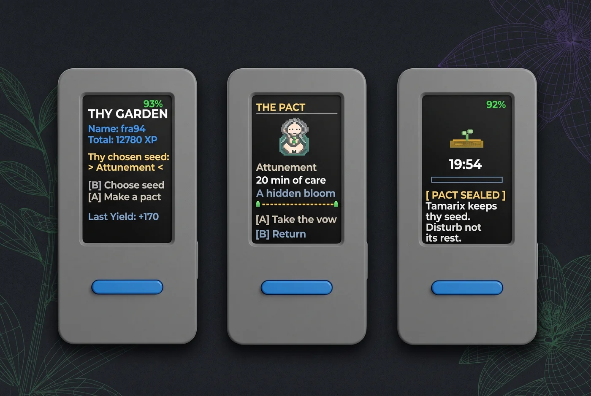

# Tamarix 🧙‍♂️🌱

**Put your phone aside. Give your life room to grow.**

Tamarix is a physical companion that helps you leave your phone behind and give
undivided attention to something you choose. Plant a seed, keep your promise,
and return to a garden grown from time well spent.

*Your garden → The pact → A seed entrusted to Tamarix. Illustrative device mockup.*

## A garden for your attention

Attention nourishes a conversation, a meal, a book, a night's rest, and the quiet
work of understanding ourselves. Tamarix takes its name from the tamarisk:
for this project, a symbol of staying rooted while remaining flexible.

The ritual makes a choice physical. A dedicated device lets you begin without
unlocking your phone; leaving both in another room puts distance between an
impulse and a check. Each plant becomes a reminder of what you chose to nurture.

Keep a pocket notebook nearby. When a question or curiosity tempts you to reach
for your phone, write it down and return to your activity. The thought can wait
without being lost.

The reward can wait, too. Tamarix saves your harvest quietly when time is up.
Return when you are ready; your book, work, or conversation need not end with
the timer.

## How it works

1. **Choose what to nurture.** Use B to browse seeds and A to review the pact.
2. **Put the phone away.** Lay it face down on a stable surface, rest the stick
   on its back with the display facing up, and leave both far from your activity,
   ideally in another room.
3. **Take the vow.** Press A to begin and keep the stick still through the opening
   sound and calibration. Moving it enough to trigger detection breaks the pact.
   Either button lets you briefly peek at progress.
4. **Return for the harvest.** A quiet green pulse marks completion. Press a button
   or move the stick to reveal your plant and its XP. Common, rare, and legendary
   plants await.

Seven seeds offer different ways to spend your time: **Nourishment, Learning,
Rest, Labour, Recreation, Attunement, and Covenant**. Each has its own collection
of plants and takes 30–60 minutes to grow, except Recreation, which remains a
one-minute trial.

Sessions work offline and save their outcomes for later synchronization.
Tamarix senses movement of the stick; it does not lock your phone or monitor
its apps. Very slow, level movements can still escape detection.

## The pact with Tamarix

  

**Tamarix, Guardian of the Plants and Minister of the Garden**, is also known
as the Lord of Plants and Keeper of Seeds. Roots and flowers weave through his
beard; his hands cradle a luminous sprout.

Planting a seed is a shared promise: Tamarix tends its growth while you put
your phone aside and spend time on your chosen activity. Keep the pact, and
the Keeper rewards your care with a harvest.

Break it, and he withdraws his grace. Tamarix does not rage. In **the Severing
of the Bough**, the sprout freezes and crumbles into rising ash. A final message
announces the withdrawal of its life-giving sap, followed by silence and darkness.

His pixel-art portrait accompanies the pact. An open pixel-art book illustrates
the **Chronicles of Tamarix**, original verses shown during loading, with time
allowed for reading. Their
language evokes medieval English while keeping modern spelling and familiar
words.

> Lay down thy device and keep thy course: who turns back shall lose the leaf.
>
> — *Chronicles of Tamarix*, Book II, 2

## Build and run

Tamarix runs on the **M5Stack StickS3**, using MicroPython on **UIFlow2**.
This repository contains the device application, artwork, audio, and tests;
the Spring Boot backend is a separate project.

- [StickS3 setup and technical guide](docs/sticks3-guide.md): installation,
  controls, session durations, updates, configuration, limitations, and tests.
- [Wi-Fi setup](docs/wifi-setup.md): connecting the stick and backend.
- [Firmware reliability](docs/firmware-reliability.md): persistence and device checks.
